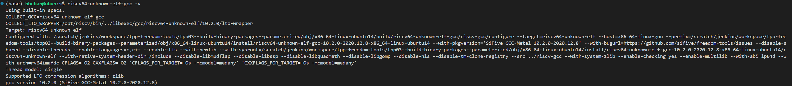

# <center> Lab1 </center>

<center> 金莫迪 廖望 李星宇 </center>

<div align="center">
  
</div>

<center> gdb 启动流程跟踪与验证 </center>

## 实验目的

本次实验的核心目标是深入理解操作系统内核从零开始的引导过程，并亲手构建一个能在 QEMU 模拟器上运行的最小化 64 位 RISC-V 操作系统内核。为了实现这一目标，我们需要掌握 QEMU 模拟器的启动机制、程序内存布局的原理以及交叉编译与链接的核心技术。

具体来说，本次实验旨在达成以下学习目标：

- 学习如何运用链接脚本（Linker Script）来精确控制内核代码和数据在内存中的布局。
- 掌握交叉编译的基本流程，能够将 C 语言和汇编源代码编译、链接成一个标准的可执行文件，并最终生成可引导的内核镜像。
- 理解并实践如何利用 OpenSBI 作为引导加载程序（Bootloader），在 QEMU 模拟环境中加载并启动我们自己编写的内核。
- 学习调用 OpenSBI 提供的底层系统服务，实现在屏幕上打印格式化字符串，为后续的内核调试奠定基础。

## 实验练习

本次实验包含两个核心练习，旨在从代码和调试两个层面，深入剖析内核的启动机制。

### 练习 1：内核入口代码分析

该练习要求我们深入分析内核的汇编入口文件`kern/init/entry.S`。通过逐行阅读代码，我们需要结合所学的操作系统启动理论，详细阐述两条关键指令的功能与目的：

1.  `la sp, bootstacktop`：解释该指令如何初始化内核栈，以及为何这是 C 语言函数得以正确运行的先决条件。
2.  `tail kern_init`：说明这条指令如何将控制权从底层汇编代码安全地转移到 C 语言编写的内核初始化函数，并解释为何使用尾调用（tail call）是此场景下的最佳选择。

### 练习 2: GDB 启动流程跟踪与验证

该练习要求我们运用 QEMU 和 GDB 调试工具，亲手跟踪并验证 RISC-V 平台从硬件加电到内核第一条指令执行的全过程。我们需要记录详细的调试步骤，并通过观察 GDB 中的状态变化，回答以下关键问题：

1.  RISC-V 处理器在加电复位后，第一条指令的物理地址在何处？
2.  这最初的几条指令（即 Boot ROM 中的代码）核心功能是什么？它们是如何将执行流程引导至下一阶段的？

通过完成这个练习，我们将掌握底层系统调试的基本方法，并对理论上的启动流程建立更加直观和深刻的认识。

## 实验过程


### 环境准备

#### 实验机基本配置

实验机的配置为


```bash
OS: Ubuntu 20.04.5 LTS x86_64 
Kernel: 5.15.0-52-generic 
CPU: 12th Gen Intel i9-12900K (24) @ 5.200GHz 
```


#### 安装预编译（prebuilt） 工具链

为了实现交叉编译，我们使用sifive公司提供的预编译工具链，进入[sifive](https://github.com/sifive/freedom-tools/releases)，选择[ubuntu14-riscv64-unknown-elf](https://static.dev.sifive.com/dev-tools/freedom-tools/v2020.12/riscv64-unknown-elf-toolchain-10.2.0-2020.12.8-x86_64-linux-ubuntu14.tar.gz)进行下载，解压到了/opt/riscv路径下面，之后编辑~/.bashrc文档，输入

```bash
export RISCV=/opt/riscv
export PATH=$RISCV/bin:$PATH
```
之后运行

```bash
source ~/.bashrc
```

完成全局配置。

输入

```bash
riscv64-unknown-elf-gcc -v
```

检查一下是否安装成功。



可以看到已经出现了gcc版本，说明预编译工具链已经安装成功了。

#### 安装qemu

为了运行riscv64代码，我们还需要安装对应的模拟器。下载对应的压缩包解压后，确认环境时报错：

```bash
ERROR: glib-2.40 gthread-2.0 is required to compile QEMU
```

安装对应包来解决

```bash
sudo apt update
sudo apt install libglib2.0-dev libpixman-1-dev
```

确认一下安装成功：

```bash
$ qemu-system-riscv64 --version
```


最后再来验证一下Qemu中的OpenSBI

```bash
$ qemu-system-riscv64 \
  --machine virt \
  --nographic \
  --bios default
```
<p align="center">
  
</p>


再尝试编译一下lab1的代码


<p align="center">
  
</p>

<!--  -->

运行成功了，输出了(THU.CST) os is loading ...，至此我们的环境准备好了，准备开干！

### 练习 1：理解启动流程

本练习重点分析内核启动流程，通过代码分析深入理解系统启动机制。

#### 内核入口点分析 (`kern/init/entry.S`)

```assembly
#include <mmu.h>
#include <memlayout.h>

    .section .text,"ax",%progbits
    .globl kern_entry
kern_entry:
    la sp, bootstacktop

    tail kern_init

.section .data
    # .align 2^12
    .align PGSHIFT
    .global bootstack
bootstack:
    .space KSTACKSIZE
    .global bootstacktop
bootstacktop:
```

通过分析汇编代码，可以清晰地理解内核启动的初始化过程：

- **`.section .text,"ax",%progbits`**

  - 这是一个汇编器指令，告诉汇编器下面的内容是可执行代码，应该被放入最终生成的可执行文件的 `.text` 段中。
  - `.globl kern_entry`使得链接器（Linker）能够找到这个地址，并将其设置为整个内核程序的入口点。
  - `kern_entry:`: 这是一个标签（Label），定义了 `kern_entry` 符号的具体地址，也就是内核的第一条指令所在的位置。

- **`la sp, bootstacktop`**

  - `sp` 是栈指针寄存器。作用是将 `bootstacktop` 这个地址加载到栈指针 `sp` 寄存器中。因为任何 C 语言函数都需要使用栈来保存局部变量、函数参数和返回地址。在执行这条指令之前，`sp` 寄存器的值是未知的、无效的。通过将 `sp` 指向我们预先定义好的一块内存区域（内核栈）的顶部，我们为即将运行的 C 函数 `kern_init` 创建了一个有效的运行环境。没有这一步，函数调用就会导致系统崩溃。

- **`tail kern_init`**
  - 等价于无返回跳转至 `kern_init`（尾调用），将控制权从汇编移交给 C 代码。
  - 由于 `kern_init` 预期不返回（初始化后进入驻留/后续流程），无需保存返回地址，使用跳转更合适。

### 问题回答

#### 1. `la sp, bootstacktop` 指令的作用是什么？

**回答：**
该指令的核心作用是**初始化内核栈**。它将预先在数据段（`.data`）中定义的 `bootstacktop` 符号的地址加载到栈指针寄存器 `sp` 中。这是 C 语言函数得以正确运行的关键前提，因为 C 函数依赖于栈来存储局部变量、函数参数和返回地址。在执行此指令前，`sp` 的值是未知的，执行此指令后，内核便拥有了一个合法、可用的栈空间。

#### 2. `tail kern_init` 指令的作用是什么？

**回答：**
该指令用于**将处理器的控制权从汇编代码（`entry.S`）转移到 C 语言代码（`kern_init` 函数）**。它是一个“尾调用（tail call）”优化，在功能上等同于一条无返回的跳转指令（`jump`）。选择尾调用是因为 `kern_init` 作为内核的初始化函数，执行后不会返回到 `entry.S`，因此无需在栈上保存返回地址，这样做既高效又简洁。

### 练习 2: 使用 GDB 验证启动流程

为了验证实验指导书中描述的启动流程，我们利用 GDB 对 QEMU 模拟的 RISC-V 环境进行调试。

首先，直接运行 `make qemu`，可以看到内核成功启动并打印了预期的信息，这证明我们的代码修改是正确的：

```bash
OpenSBI v1.3
   ____                    _____ ____ _____
  / __ \                  / ____|  _ \_   _|
 | |  | |_ __   ___ _ __ | (___ | |_) || |
 | |  | | '_ \ / _ \ '_ \ \___ \|  _ < | |
 | |__| | |_) |  __/ | | |____) | |_) || |_
  \____/| .__/ \___|_| |_|_____/|___/_____|
        | |
        |_|

Platform Name             : ucbbar,spike-bare,qemu
Platform Features         : medeleg
Platform HART Count       : 1
Platform IPI Device       : aclint-mswi
Platform Timer Device     : aclint-mtimer @ 10000000Hz
Platform Console Device   : htif
Platform HSM Device       : ---
Platform PMU Device       : ---
Platform Reboot Device    : htif
Platform Shutdown Device  : htif
Platform Suspend Device   : ---
Platform CPPC Device      : ---
Firmware Base             : 0x80000000
Firmware Size             : 322 KB
Firmware RW Offset        : 0x40000
Firmware RW Size          : 66 KB
Firmware Heap Offset      : 0x48000
Firmware Heap Size        : 34 KB (total), 2 KB (reserved), 9 KB (used), 22 KB (free)
Firmware Scratch Size     : 4096 B (total), 736 B (used), 3360 B (free)
Runtime SBI Version       : 1.0

Domain0 Name              : root
Domain0 Boot HART         : 0
Domain0 HARTs             : 0*
Domain0 Region00          : 0x0000000002000000-0x000000000200ffff M: (I,R,W) S/U: ()
Domain0 Region01          : 0x0000000080040000-0x000000008005ffff M: (R,W) S/U: ()
Domain0 Region02          : 0x0000000080000000-0x000000008003ffff M: (R,X) S/U: ()
Domain0 Region03          : 0x0000000000000000-0xffffffffffffffff M: (R,W,X) S/U: (R,W,X)
Domain0 Next Address      : 0x0000000080200000
Domain0 Next Arg1         : 0x0000000087e00000
Domain0 Next Mode         : S-mode
Domain0 SysReset          : yes
Domain0 SysSuspend        : yes

Boot HART ID              : 0
Boot HART Domain          : root
Boot HART Priv Version    : v1.12
Boot HART Base ISA        : rv64imafdch
Boot HART ISA Extensions  : none
Boot HART PMP Count       : 16
Boot HART PMP Granularity : 4
Boot HART PMP Address Bits: 54
Boot HART MHPM Count      : 16
Boot HART MIDELEG         : 0x0000000000001666
Boot HART MEDELEG         : 0x0000000000f0b509
(THU.CST) os is loading ...
```

以下是 GDB 调试详细步骤：

1. **调试环境准备**

   a. **终端一 (QEMU Server):** 运行 `make debug`，使 QEMU 在第一条指令处暂停并等待连接。
   b. **终端二 (GDB Client):** 运行 `make gdb`，连接到 QEMU 并加载内核符号。

2. **GDB 连接与初始断点 (Boot ROM)**

   GDB 连接成功后，程序立即暂停。我们查看程序计数器 `pc`，发现它停在了 `0x1000`。

   ```gdb
   Remote debugging using localhost:1234
   0x0000000000001000 in ?? ()
   ```

   - **分析:** 这证实了 **RISC-V 硬件加电后，CPU 执行的第一条指令位于物理地址 `0x1000`**。这是 QEMU 模拟的 Boot ROM 的入口点。它的唯一任务就是进行最基础的设置，然后跳转到下一阶段的引导程序——OpenSBI。

3. **验证 OpenSBI 的启动**

   我们在 OpenSBI 固件的入口地址 `0x80000000` 设置一个断点，然后用 `c` (continue) 命令让程序运行到此处。

   ```gdb
   (gdb) b *0x80000000
   Breakpoint 1 at 0x80000000
   (gdb) c
   Continuing.

   Breakpoint 1, 0x0000000080000000 in ?? ()
   ```

   - **分析:** 程序成功地停在了 `0x80000000`。这说明 Boot ROM 已经完成了它的历史使命，将控制权顺利移交给了 OpenSBI 固件。

4. **验证内核的启动**

   在 OpenSBI 的断点之后，我们紧接着在内核入口 `kern_entry` (`0x80200000`) 处设置第二个断点。然后输入**第一次 `c` 命令**。

   ```gdb
   (gdb) b kern_entry
   Breakpoint 2 at 0x80200000: file kern/init/entry.S, line 4.
   (gdb) c
   Continuing.

   Breakpoint 2, kern_entry () at kern/init/entry.S:4
   4           la sp, bootstacktop
   ```

   - **分析:** 程序准确地停在了我们内核的第一行代码上。这清晰地展示了 **从 OpenSBI (`0x80000000`) -> ucore 内核 (`0x80200000`)** 的跳转。此时，QEMU 终端会打印出 OpenSBI 的全部初始化信息，并显示 `Domain0 Next Address` 指向我们的内核。

5. **检查内核入口时的寄存器状态**

   在 `kern_entry` 断点处，我们使用 `i r` (info registers) 命令检查 CPU 寄存器，分析 OpenSBI 向内核传递了哪些信息：

   ```gdb
   (gdb) i r
   ra             0x8000ae9a       0x8000ae9a
   sp             0x80046eb0       0x80046eb0
   gp             0x0      0x0
   tp             0x80047000       0x80047000
   t0             0x0      0
   t1             0x2      2
   t2             0x1000   4096
   fp             0x80046ef0       0x80046ef0
   s1             0x1      1
   a0             0x0      0
   a1             0x87e00000       2279604224
   a2             0x7      7
   a3             0x19     25
   a4             0x80     128
   a5             0x1      1
   a6             0x1      1
   a7             0x5      5
   s2             0x0      0
   s3             0x80200000       2149580800
   s4             0x0      0
   s5             0x87e00000       2279604224
   s6             0x8000000a00006800       -9223371993905076224
   s7             0x80040040       2147745856
   s8             0x2000   8192
   s9             0x800426e0       2147755744
   s10            0x0      0
   s11            0x0      0
   t3             0x10     16
   t4             0x80046dda       2147773914
   t5             0xf      15
   t6             0x27     39
   pc             0x80200000       0x80200000 <kern_entry>
   ```

   - **分析:**

     - **`pc` (Program Counter):** 值为 `0x80200000`，确认 CPU 正准备执行内核的第一条指令。
     - **`a0`**: 值为 `0`，根据 RISC-V SBI 规范，这传递的是 **HART ID**（硬件线程 ID）。
     - **`a1`**: 值为 `0x87e00000`，这传递的是 **Device Tree Blob (DTB)** 的物理地址，内核将通过它来了解硬件布局。

     这个步骤验证了 OpenSBI 不仅移交了控制权，还通过寄存器正确地传递了必要的启动参数。

6. **恢复执行并观察最终输出**

   在检查完寄存器后，在 GDB 中输入**第二次 `c` 命令**，让内核从 `kern_entry` 断点处恢复执行。此时，我们才会在 QEMU 终端中看到预期的输出：

   ```
   (THU.CST) os is loading ...
   ```

   - **分析:** 这证明了从 `kern_entry` 开始，我们的汇编代码正确地设置了栈指针，并成功跳转到 `kern_init` C 函数，最终完成了打印任务。整个调试过程需要两次 `continue`，分别跨越了 Boot ROM -> OpenSBI 和 OpenSBI -> Kernel 两个阶段。

通过以上详细的 GDB 调试步骤，我们完整地、分步地验证了从硬件上电到内核 C 代码执行的整个启动链条，与理论分析完全一致。

### 问题回答

#### 问题 1：RISC-V 硬件加电后最初执行的几条指令位于什么地址？

**回答：**
通过 GDB 调试，我们观察到，在 QEMU `virt` 平台上模拟的 RISC-V 硬件“加电”后，CPU 最初执行的指令位于物理地址 `0x1000`。

#### 问题 2：最初的几条指令主要完成了哪些功能？

**回答：**
位于 `0x1000` 处的 Boot ROM 代码有以下两个功能：

1.  **建立最小化执行环境**：进行最基础的硬件设置，例如可能会初始化一些关键的控制状态寄存器（CSRs），为跳转到更复杂的软件环境做准备。
2.  **移交控制权**：其最终、也是最重要的任务，是执行一条跳转指令，将 CPU 的控制权永久地移交给下一阶段的引导加载程序（Bootloader）。在本次实验中，它跳转到了位于物理地址 `0x80000000` 的 OpenSBI 固件。

### 运行流程分析

通过对 `entry.S`、`init.c` 和 `kernel.ld` 三个关键文件的分析，我们将内核的完整启动过程理解为以下四个阶段：

#### 阶段一：固件引导阶段 (OpenSBI)

1.  QEMU 模拟器上电，CPU 开始执行由 `-bios` 参数指定的 OpenSBI 固件代码。
2.  OpenSBI 进行底层的硬件探测与初始化（例如 CPU 特性、内存大小等）。
3.  OpenSBI 将由 `-kernel` 参数指定的 `kernel.bin` 文件从（模拟的）磁盘加载到链接脚本中指定的物理内存起始地址 `0x80200000`。
4.  完成所有准备工作后，OpenSBI 执行一条跳转指令，将 CPU 的控制权移交给 `0x80200000` 这个地址。

#### 阶段二：汇编入口与环境准备阶段（`entry.S`）

1.  CPU 开始执行位于 `0x80200000` 的内核第一条指令，即 `kern_entry` 标签处。
2.  执行 `la sp, bootstacktop`，这是至关重要的一步。它将栈指针 `sp` 寄存器设置为我们预先在 `.data` 段中分配好的内核栈的顶部地址。这一步为即将到来的 C 函数调用创建了必需的运行环境。
3.  执行 `tail kern_init`，程序直接跳转到 C 语言实现的 `kern_init` 函数，正式将控制权交给 C 代码。

#### 阶段三：C 语言级别初始化阶段（`init.c`）

1.  `kern_init` 函数开始执行。
2.  首先，通过 `memset(edata, 0, end - edata)` 清理 BSS 段。`edata` 和 `end` 是由链接脚本提供的地址，分别代表 `.data` 段的结束和 `.bss` 段的结束。此操作确保了所有未初始化的全局变量都被置为 0，符合 C 语言标准。
3.  调用 `cprintf` 函数，通过 OpenSBI 提供的 SBI 服务向控制台打印内核的启动信息。这标志着内核的高级功能（如函数调用、格式化输出）已可以正常工作。

#### 阶段四：内核驻留与等待阶段（`init.c`）

1.  在完成所有初始化任务后，内核执行 `while(1);` 指令，进入一个无限死循环。
2.  这标志着引导过程的结束。内核已经完全接管了 CPU 的控制权，并稳定地运行在一个受控状态。此时，它“暂停”在这里，等待未来的事件（例如在后续实验中将要实现的中断）来驱动它执行更多任务。

### 问题排查与解决

在初次运行时，遇到了一个问题：QEMU 正常启动，OpenSBI 也打印了初始化信息，但预期的 `(THU.CST) os is loading ...` 消息并未出现，程序在 OpenSBI 初始化后就停止了。

#### 现象分析

仔细观察 OpenSBI 的启动日志，发现其中一行关键信息：

```
Domain0 Next Address      : 0x0000000000000000
```

`Next Address` 字段指示了 OpenSBI 接下来应该跳转去执行的地址。在我们的设计中，这个地址应该是内核的加载地址 `0x80200000`。然而，日志中显示为 `0x0`，这说明 OpenSBI 根本不知道下一步要去哪里，因此内核代码从未被执行。

#### 原因定位

这个问题直接指向了 `Makefile` 中启动 QEMU 的命令。检查 `Makefile` 发现，我们使用了 `-device loader,file=$(UCOREIMG),addr=0x80200000` 的方式来加载内核。这种方式是用于加载裸二进制镜像（`.img` 文件）的。

然而，从 OpenSBI v1.3 的行为来看，它似乎不再支持或默认不再使用这种 `loader` 设备来引导 S 模式的内核。新版本的 QEMU 和 OpenSBI 更倾向于使用 `-kernel` 参数直接接收一个 ELF 格式的可执行文件，由它们内部协同完成加载和跳转。

#### 解决方案

为了解决这个兼容性问题，我对 `Makefile` 中的 `qemu` 和 `debug` 目标进行了修改，将 QEMU 的启动命令从：

```makefile
# 旧命令
$(V)$(QEMU) \
    -machine virt \
    -nographic \
    -bios default \
    -device loader,file=$(UCOREIMG),addr=0x80200000
```

修改为更通用和现代的 `-kernel` 方式：

```makefile
# 新命令
$(V)$(QEMU) -kernel $(kernel) -nographic
```

这里 `$(kernel)` 变量指向的是 ELF 格式的内核文件 `bin/kernel`，而不是二进制镜像 `bin/ucore.img`。

#### 结果验证

修改 `Makefile` 后，再次运行 `make qemu`，内核成功启动并打印出了预期的欢迎信息，证明问题得到解决。这个排查过程也加深了对 QEMU 启动参数和 OpenSBI 引导机制的理解。

## 学习收获

通过本次实验，我们不仅掌握了理论知识，更在实践中获得了宝贵的经验：

1.  **系统启动流程的深入理解**：
    我们清晰地验证了计算机系统从硬件上电到操作系统内核运行的完整分层启动链：**Boot ROM (`0x1000`) -> Bootloader/OpenSBI (`0x80000000`) -> ucore 内核 (`0x80200000`)**。我们理解了每一阶段的核心任务：Boot ROM 进行最小化硬件初始化并移交控制权；OpenSBI 负责引导加载，准备 S 模式环境，并通过寄存器 (`a0`, `a1`) 向内核传递关键参数（HART ID 和 DTB 地址）；最后内核接管控制权。

2.  **GDB 断点调试的实战技巧**：
    我们学习了如何使用 GDB 对底层系统进行“黑盒”调试。通过在启动链的关键地址（`0x1000`, `0x80000000`, `0x80200000`）设置断点，我们得以“暂停”时间，观察每一步的执行结果，从而验证了理论。特别是学会了通过 `i r` 命令检查寄存器状态，这对于理解 OpenSBI 如何与我们的内核进行“交接”至管重要。

3.  **环境配置与兼容性的重要性**：
    我们深刻体会到，搭建一个稳定可靠的交叉编译环境是实验成功的基础。我们遇到了工具链 `PATH` 环境变量未生效、`tar` 解压路径与预期不符等典型问题，并学会了通过创建符号链接 (`ln -s`) 和修改 `Makefile` 中的绝对路径来解决。更重要的是，我们理解了软件版本兼容性的影响——新版 OpenSBI/QEMU 对内核加载方式的改变（从 `-device loader` 到 `-kernel`）是导致我们初期启动失败的核心原因。

4.  **问题排查的方法论**：
    本次实验最有价值的收获之一是建立了一套科学的问题排查流程：**观察现象**（内核无输出） -> **分析日志**（OpenSBI 的 `Next Address` 为 `0x0`） -> **提出假设**（QEMU 启动参数有误） -> **验证假设**（修改 `Makefile` 并测试） -> **解决问题**。这个过程锻炼了我们从现象到本质的分析能力。

## 实验总结

本次实验成功完成了操作系统内核引导部分的学习与实践任务。通过亲手修改代码、编译、运行，并借助 GDB 进行深入调试，我们不仅构建了一个最小化的可执行内核，还掌握了：

- 完整的操作系统内核编译和启动流程。
- RISC-V 架构的基本汇编指令和 C 语言混合编程。
- 交叉编译工具链的配置、使用与问题排查。
- 使用 QEMU 和 GDB 进行底层系统调试和分析的关键技术。

更重要的是，通过解决实验中遇到的实际问题，我们锻炼了分析和解决问题的能力，对理论知识的理解也更加深刻。
