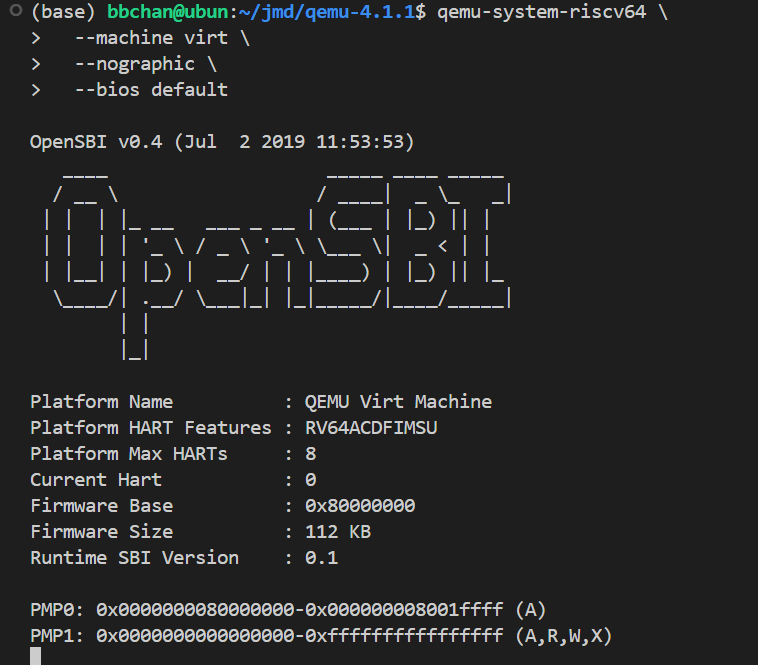

# <center> Lab1 </center>

<center> 金莫迪 廖望 李星宇 </center>

## 环境准备

### 实验机基本配置

为了方便多人协作，我们使用同一台实验机完成实验任务，实验机的配置为


```bash
OS: Ubuntu 20.04.5 LTS x86_64 
Kernel: 5.15.0-52-generic 
CPU: 12th Gen Intel i9-12900K (24) @ 5.200GHz 
```

通过生成sha256实现多人的共同访问，使用vscode ssh-remote进行连接


### 安装预编译（prebuilt） 工具链

为了实现交叉编译，我们使用sifive公司提供的预编译工具链，进入[sifive](https://github.com/sifive/freedom-tools/releases)，选择[ubuntu14-riscv64-unknown-elf](https://static.dev.sifive.com/dev-tools/freedom-tools/v2020.12/riscv64-unknown-elf-toolchain-10.2.0-2020.12.8-x86_64-linux-ubuntu14.tar.gz)进行下载，解压到了/opt/riscv路径下面，之后编辑~/.bashrc文档，输入

```bash
export RISCV=/opt/riscv
export PATH=$RISCV/bin:$PATH
```
之后运行

```bash
source ~/.bashrc
```

完成全局配置。

输入

```bash
riscv64-unknown-elf-gcc -v
```

检查一下是否安装成功。


可以看到已经出现了gcc版本，说明预编译工具链已经安装成功了。

### 安装qemu

为了运行riscv64代码，我们还需要安装对应的模拟器。下载对应的压缩包解压后，确认环境时报错：

```bash
ERROR: glib-2.40 gthread-2.0 is required to compile QEMU
```

安装对应包来解决

```bash
sudo apt update
sudo apt install libglib2.0-dev libpixman-1-dev
```

确认一下安装成功：

```bash
$ qemu-system-riscv64 --version
```


最后再来验证一下Qemu中的OpenSBI

```bash
$ qemu-system-riscv64 \
  --machine virt \
  --nographic \
  --bios default
```



再尝试编译一下lab1的代码


运行成功了，输出了(THU.CST) os is loading ...，至此我们的环境准备好了，准备开干！


## 实验过程


### 练习 1：理解启动流程

本练习重点分析内核启动流程，通过代码分析深入理解系统启动机制。

#### 1. 内核入口点分析 (`kern/init/entry.S`)

```assembly
#include <mmu.h>
#include <memlayout.h>

    .section .text,"ax",%progbits
    .globl kern_entry
kern_entry:
    la sp, bootstacktop

    tail kern_init

.section .data
    # .align 2^12
    .align PGSHIFT
    .global bootstack
bootstack:
    .space KSTACKSIZE
    .global bootstacktop
bootstacktop:
```

通过分析汇编代码，可以清晰地理解内核启动的初始化过程：
##### 1. `.section .text,"ax",%progbits` 
- 这是一个汇编器指令，告诉汇编器下面的内容是可执行代码，应该被放入最终生成的可执行文件的 `.text` 段中。
- `.globl kern_entry`使得链接器（Linker）能够找到这个地址，并将其设置为整个内核程序的入口点。
- `kern_entry:`: 这是一个标签（Label），定义了 `kern_entry` 符号的具体地址，也就是内核的第一条指令所在的位置。

##### 2. `la sp, bootstacktop` 
- `sp` 是栈指针寄存器。作用是将 `bootstacktop` 这个地址加载到栈指针 `sp` 寄存器中。因为任何 C 语言函数都需要使用栈来保存局部变量、函数参数和返回地址。在执行这条指令之前，`sp` 寄存器的值是未知的、无效的。通过将 `sp` 指向我们预先定义好的一块内存区域（内核栈）的顶部，我们为即将运行的 C 函数 `kern_init` 创建了一个有效的运行环境。没有这一步，函数调用就会导致系统崩溃。

##### 3. `tail kern_init`
- 指令: tail 实际上是一个跳转指令 (j kern_init)。它是一种特殊的“尾调用”优化。使程序无条件地跳转到 kern_init 函数的地址去执行。 将控制权从汇编代码移交给 C 语言代码。kern_init 是我们在 init.c 中定义的内核初始化函数。使用 tail  而不是 call 的原因是：kern_init 函数理论上永远不会返回。操作系统初始化完成后会进入一个空闲循环或者启动第一个用户进程，它没有“返回地址”的概念。因此，使用 j (跳转) 更能准确地表达这种控制权的永久移交。该设计体现了系统启动的分层思想：汇编代码负责最基本的硬件初始化，然后快速跳转到 C 代码处理更复杂的逻辑。

总之，以上操作为C语言程序的运行提供了空间，又把控制权交给了程序，完成了入口点的作用


### 练习2 使用GDB验证启动流程

下面我们就要开始实际验证启动流程，首先是编译。编译过程顺利完成，项目结构组织良好，终端结果如下：
```ld
+ cc kern/init/init.c
+ ld bin/kernel
riscv64-unknown-elf-objcopy bin/kernel --strip-all -O binary bin/ucore.img

OpenSBI v0.4 (Jul  2 2019 11:53:53)
   ____                    _____ ____ _____
  / __ \                  / ____|  _ \_   _|
 | |  | |_ __   ___ _ __ | (___ | |_) || |
 | |  | | '_ \ / _ \ '_ \ \___ \|  _ < | |
 | |__| | |_) |  __/ | | |____) | |_) || |_
  \____/| .__/ \___|_| |_|_____/|____/_____|
        | |
        |_|

Platform Name          : QEMU Virt Machine
Platform HART Features : RV64ACDFIMSU
Platform Max HARTs     : 8
Current Hart           : 0
Firmware Base          : 0x80000000
Firmware Size          : 112 KB
Runtime SBI Version    : 0.1

PMP0: 0x0000000080000000-0x000000008001ffff (A)
PMP1: 0x0000000000000000-0xffffffffffffffff (A,R,W,X)
(THU.CST) os is loading ...
```
生成了以下文件：

- `bin/kernel`：ELF 格式内核可执行文件，大小约 16KB
- `bin/ucore.img`：二进制内核镜像，用于 QEMU 模拟器
- 生成了相应的目标文件和符号表，便于调试分析


### 运行流程分析

通过对 `entry.S`、`init.c` 和 `kernel.ld` 三个关键文件的分析，我们将内核的完整启动过程理解为以下四个阶段：

#### 阶段一：固件引导阶段 (OpenSBI)
1. QEMU 模拟器上电，CPU 开始执行由 `-bios` 参数指定的 OpenSBI 固件代码。
2. OpenSBI 进行底层的硬件探测与初始化（例如 CPU 特性、内存大小等）。
3. OpenSBI 将由 `-kernel` 参数指定的 `kernel.bin` 文件从（模拟的）磁盘加载到链接脚本中指定的物理内存起始地址 `0x80200000`。
4. 完成所有准备工作后，OpenSBI 执行一条跳转指令，将 CPU 的控制权移交给 `0x80200000` 这个地址。


#### 阶段二：汇编入口与环境准备阶段（`entry.S`）
1. CPU 开始执行位于 `0x80200000` 的内核第一条指令，即 `kern_entry` 标签处。
2. 执行 `la sp, bootstacktop`，这是至关重要的一步。它将栈指针 `sp` 寄存器设置为我们预先在 `.data` 段中分配好的内核栈的顶部地址。这一步为即将到来的 C 函数调用创建了必需的运行环境
3. 执行 `tail kern_init`，程序直接跳转到 C 语言实现的 `kern_init` 函数，正式将控制权交给 C 代码。


#### 阶段三：C 语言级别初始化阶段（`init.c`）
1. `kern_init` 函数开始执行。
2. 首先，通过 `memset(edata, 0, end - edata)` 清理 BSS 段。`edata` 和 `end` 是由链接脚本提供的地址，分别代表 `.data` 段的结束和 `.bss` 段的结束。此操作确保了所有未初始化的全局变量都被置为 0，符合 C 语言标准。
3. 调用 `cprintf` 函数，通过 OpenSBI 提供的 SBI 服务向控制台打印内核的启动信息。这标志着内核的高级功能（如函数调用、格式化输出）已可以正常工作。


#### 阶段四：内核驻留与等待阶段（`init.c`）
1. 在完成所有初始化任务后，内核执行 `while(1);` 指令，进入一个无限死循环。
2. 这标志着引导过程的结束。内核已经完全接管了 CPU 的控制权，并稳定地运行在一个受控状态。此时，它“暂停”在这里，等待未来的事件（例如在后续实验中将要实现的中断）来驱动它执行更多任务。

### GBD调试
通过设置断点，跟踪运行过程。
- 连接后，输入指令`riscv64-unknown-elf-gdb``(gdb) target remote localhost:26000`，查看PC值，发现程序自动停在Boot ROM的入口 `0x1000`。
- 查看`0x1000`处的初始指令
  ```ld
  (gdb) x/5i $pc
   0x1000:	auipc	t0,0x0
   0x1004:	addi	t0,t0,32
   0x1008:	csrw	mtvec,t0
   0x100c:	li	t1,2048
   0x1010:	add	sp,sp,t1
  ```
- 我在 OpenSBI 固件的入口 `0x80000000` 处设置断点，并使用 `continue` 命令执行，程序成功在此处中断,完成移交程序。
- 我加载了内核的符号文件（`symbol-file bin/kernel.elf`），并在我们自己的内核入口 `kern_entry`（即 `0x80200000`）处设置断点。再次 `continue`，程序在执行完 OpenSBI 的引导流程后，停在了我们内核的第一行汇编代码上。

通过以上步骤，我成功地观察到了从 Boot ROM -> OpenSBI -> Kernel 的完整控制权移交过程。
### 问题回答
### 问题1：RISC-V 硬件加电后最初执行的几条指令位于什么地址？

**回答：**
通过 GDB 调试，我观察到，在 QEMU `virt` 平台上模拟的 RISC-V 硬件“加电”后，CPU 最初执行的指令位于物理地址 `0x1000`。

### 问题2：最初的几条指令主要完成了哪些功能？

**回答：**
位于 `0x1000`处的 Boot ROM代码有以下两个功能：
1. 建立最小化执行环境：进行最基础的硬件设置，例如可能会初始化一些关键的控制状态寄存器（CSRs），为跳转到更复杂的软件环境做准备。
2. 移交控制权：其最终、也是最重要的任务，是执行一条跳转指令，将 CPU 的控制权永久地移交给下一阶段的引导加载程序（Bootloader）。在本次实验中，它跳转到了位于物理地址 `0x80000000` 的 OpenSBI 固件。


### 学习收获

1. **系统启动理解**：
深入理解了计算机系统从硬件启动到操作系统内核加载的完整流程。认识到引导加载程序和操作系统内核的分工协作关系，前者负责早期硬件初始化，后者负责系统功能实现。

2. **断点调试技术**：
  学习了如何通过断点调试了解整个程序的运行过程


## 实验总结

本次实验成功完成了内核启动基础的学习任务。通过实践掌握了：

- 完整的操作系统内核编译和启动流程
- RISC-V 架构的基本概念和汇编编程
- 交叉编译工具链的使用方法
- 内核调试和分析技术


