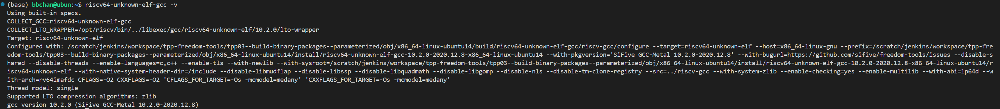
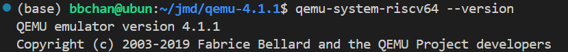
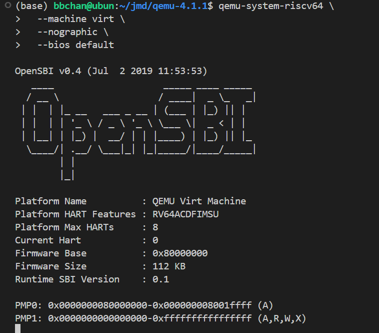
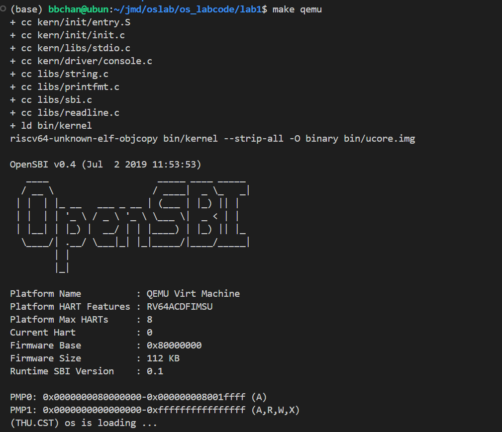

# <center> Lab1 </center>

<center> 金莫迪 廖望 李星宇 </center>

## 环境准备

### 实验机基本配置

为了方便多人协作，我们使用同一台实验机完成实验任务，实验机的配置为


```bash
OS: Ubuntu 20.04.5 LTS x86_64 
Kernel: 5.15.0-52-generic 
CPU: 12th Gen Intel i9-12900K (24) @ 5.200GHz 
```

通过生成sha256实现多人的共同访问，使用vscode ssh-remote进行连接


### 安装预编译（prebuilt） 工具链

为了实现交叉编译，我们使用sifive公司提供的预编译工具链，进入[sifive](https://github.com/sifive/freedom-tools/releases)，选择[ubuntu14-riscv64-unknown-elf](https://static.dev.sifive.com/dev-tools/freedom-tools/v2020.12/riscv64-unknown-elf-toolchain-10.2.0-2020.12.8-x86_64-linux-ubuntu14.tar.gz)进行下载，解压到了/opt/riscv路径下面，之后编辑~/.bashrc文档，输入

```bash
export RISCV=/opt/riscv
export PATH=$RISCV/bin:$PATH
```
之后运行

```bash
source ~/.bashrc
```

完成全局配置。

输入

```bash
riscv64-unknown-elf-gcc -v
```

检查一下是否安装成功。



可以看到已经出现了gcc版本，说明预编译工具链已经安装成功了。

### 安装qemu

为了运行riscv64代码，我们还需要安装对应的模拟器。下载对应的压缩包解压后，确认环境时报错：

```bash
ERROR: glib-2.40 gthread-2.0 is required to compile QEMU
```

安装对应包来解决

```bash
sudo apt update
sudo apt install libglib2.0-dev libpixman-1-dev
```

确认一下安装成功：

```bash
$ qemu-system-riscv64 --version
```



最后再来验证一下Qemu中的OpenSBI

```bash
$ qemu-system-riscv64 \
  --machine virt \
  --nographic \
  --bios default
```



再尝试编译一下lab1的代码



运行成功了，输出了(THU.CST) os is loading ...，至此我们的环境准备好了，准备开干！