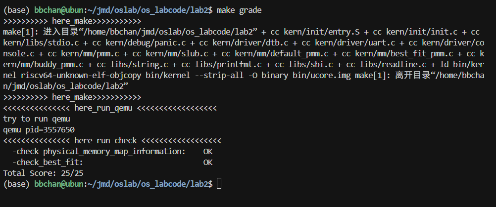

# <center> Lab2 </center>

<center> 金莫迪 廖望 李星宇 </center>

<!-- <div align="center">
  
</div>

<center> gdb 启动流程跟踪与验证 </center> -->

## 实验目的

- 理解页表的建立和使用方法
- 理解物理内存的管理方法
- 理解页面分配算法

## 实验练习

本次实验包含两个核心练习和三个挑战练习。本次的实验主要是在实验一的基础上完成物理内存管理，并建立一个最简单的页表映射。

### 练习1：理解first-fit 连续物理内存分配算法（思考题）

first-fit 连续物理内存分配算法作为物理内存分配一个很基础的方法，需要同学们理解它的实现过程。请大家仔细阅读实验手册的教程并结合kern/mm/default_pmm.c中的相关代码，认真分析default_init，default_init_memmap，default_alloc_pages， default_free_pages等相关函数，并描述程序在进行物理内存分配的过程以及各个函数的作用。 请在实验报告中简要说明你的设计实现过程。请回答如下问题：

- 你的first fit算法是否有进一步的改进空间？

### 练习2：实现 Best-Fit 连续物理内存分配算法（需要编程）

在完成练习一后，参考kern/mm/default_pmm.c对First Fit算法的实现，编程实现Best Fit页面分配算法，算法的时空复杂度不做要求，能通过测试即可。 请在实验报告中简要说明你的设计实现过程，阐述代码是如何对物理内存进行分配和释放，并回答如下问题：

- 你的 Best-Fit 算法是否有进一步的改进空间？

### 扩展练习Challenge：buddy system（伙伴系统）分配算法（需要编程）
Buddy System算法把系统中的可用存储空间划分为存储块(Block)来进行管理, 每个存储块的大小必须是2的n次幂(Pow(2, n)), 即1, 2, 4, 8, 16, 32, 64, 128...

参考伙伴分配器的一个极简实现， 在ucore中实现buddy system分配算法，要求有比较充分的测试用例说明实现的正确性，需要有设计文档。

### 扩展练习Challenge：任意大小的内存单元slub分配算法（需要编程）
slub算法，实现两层架构的高效内存单元分配，第一层是基于页大小的内存分配，第二层是在第一层基础上实现基于任意大小的内存分配。可简化实现，能够体现其主体思想即可。

参考linux的slub分配算法/，在ucore中实现slub分配算法。要求有比较充分的测试用例说明实现的正确性，需要有设计文档。

### 扩展练习Challenge：硬件的可用物理内存范围的获取方法（思考题）
如果 OS 无法提前知道当前硬件的可用物理内存范围，请问你有何办法让 OS 获取可用物理内存范围？

## 实验过程


### 练习 1：理解first-fit 连续物理内存分配算法（思考题）

本练习重点分析内核启动流程，通过代码分析深入理解系统启动机制。

`First-Fit`（首次适应）算法是一种动态内存分配算法。其核心思想是，当需要分配内存时，从头开始遍历空闲内存块链表，并选择第一个大小足够满足请求的空闲块进行分配。如果这个块比请求的大小要大，就将其分割成两部分：一部分用于满足请求，另一部分（剩余部分）作为一个新的、更小的空闲块保留在链表中。

核心代码在 `kern/mm/default_pmm.c` 中。该实现通过一个名为 `free_area_t` 的结构体来管理所有空闲的物理内存。这个结构体包含两个核心部分：

- `list_entry_t free_list`：一个双向链表的头结点。所有空闲的内存块都通过 `Page` 结构中的 `page_link` 成员链接到这个链表上。为了方便合并操作，这个链表始终保持按物理地址**从低到高**的顺序。
- `unsigned int nr_free`：一个计数器，记录当前所有空闲页的总数。


#### **核心函数作用分析**

#### 1\. **`default_init(void)`**

  * **作用**：初始化物理内存管理器。
  * **过程描述**：
    1.  调用 `list_init(&free_list)`，将 `free_list` 链表头初始化为一个空的双向循环链表（即其 `next` 和 `prev` 指针都指向自身）。
    2.  将 `nr_free`（全局空闲页计数器）清零。

#### 2\. **`default_init_memmap(struct Page *base, size_t n)`**

  * **作用**：将一段探测到的、可用的物理内存区域添加到 `free_list` 中。
  * **过程**：
    1.  遍历这 `n` 个 `Page` 结构，将它们的 `flags` 和 `property` 清零，并设置引用计数 `ref` 为0，确保它们处于一个干净的“空闲”状态。
        ```c
        struct Page *p = base;
        for (; p != base + n; p ++) {
            assert(PageReserved(p));
            p->flags = p->property = 0;
            set_page_ref(p, 0);
        }
        ```
    2.  设置块头信息：
          * `base->property = n;`：将整个连续空闲块的大小 `n` 存储在**这个块的第一个 `Page` 结构**的 `property` 成员中。
          * `SetPageProperty(base)`：将第一个页的标志位设置为 `PG_property`，表示这是一个空闲块的起始页。
          * `nr_free += n;`：更新全局空闲页计数。
        <!-- end list -->
        ```c
        base->property = n;
        SetPageProperty(base);
        nr_free += n;
        ```
    3.  最后，将这个新的空闲块（由 `base` 代表）按**物理地址有序**地插入到全局 `free_list` 链表中。它通过遍历链表找到第一个地址比 `base` 大的空闲块，然后将 `base` 插入到它的前面；如果 `base` 的地址最大，则插入到链表末尾。
        ```c
        if (list_empty(&free_list)) {
            list_add(&free_list, &(base->page_link));
        } else {
            list_entry_t* le = &free_list;
            while ((le = list_next(le)) != &free_list) {
                struct Page* page = le2page(le, page_link);
                if (base < page) {
                    list_add_before(le, &(base->page_link));
                    break;
                } else if (list_next(le) == &free_list) {
                    list_add(le, &(base->page_link));
                    break;
                }
            }
        }
        ```

#### 3\. **`default_alloc_pages(size_t n)`**

  * **作用**：实现 First-Fit 算法的核心逻辑，从 `free_list` 中分配 `n` 个连续的物理页。
  * **过程描述**：
    1.  首先进行合法性检查，如果请求的 `n` 大于总空闲页数 `nr_free`，则说明内存不足，直接返回 `NULL`。
        ```c
        assert(n > 0);
        if (n > nr_free) {
            return NULL;
        }
        ```
    2.  **遍历查找**：从 `free_list` 的头部开始，循环遍历每一个空闲块，查找**第一个**大小 (`p->property`) 大于或等于 `n` 的块。
        ```c
        struct Page *page = NULL;
        list_entry_t *le = &free_list;
        while ((le = list_next(le)) != &free_list) {
            struct Page *p = le2page(le, page_link);
            if (p->property >= n) {
                page = p;
                break;
            }
        }
        ```
    3.  **执行分配与分割**：如果找到了合适的块 (`page != NULL`)，先将这个找到的块从 `free_list` 中移除。如果找到的块比需要的大 (`page->property > n`)，则将剩余部分构造成一个新的空闲块，并将其插回到原先的位置。再更新全局空闲页数 `nr_free`，并清除被分配块的 `PG_property` 标志位。
        <!-- end list -->
        ```c
        if (page != NULL) {
            list_entry_t* prev = list_prev(&(page->page_link));
            list_del(&(page->page_link));
            if (page->property > n) {
                struct Page *p = page + n;
                p->property = page->property - n;
                SetPageProperty(p);
                list_add(prev, &(p->page_link));
            }
            nr_free -= n;
            ClearPageProperty(page);
        }
        ```
    4.  最后返回分配到的块的起始页 `page` 的指针。如果未找到，则返回 `NULL`。
        ```c
        return page;
        ```

#### 4\. **`default_free_pages(struct Page *base, size_t n)`**

  * **作用**：释放从 `base` 开始的 `n` 个连续物理页，并将它们归还给 `free_list`，同时尝试与相邻的空闲块进行**合并**。
  * **过程描述**：
    1.  首先，将要释放的 `n` 个页的状态重置为空闲状态，并设置好新空闲块的块头信息 (`base->property = n`)。
        ```c
        assert(n > 0);
        struct Page *p = base;
        for (; p != base + n; p ++) {
            assert(!PageReserved(p) && !PageProperty(p));
            p->flags = 0;
            set_page_ref(p, 0);
        }
        base->property = n;
        SetPageProperty(base);
        nr_free += n;
        ```
    2.  将这个新形成的空闲块按地址有序地插入到 `free_list` 中。
        ```c
        // 插入逻辑与 default_init_memmap 类似
        if (list_empty(&free_list)) {
            list_add(&free_list, &(base->page_link));
        } else {
            list_entry_t* le = &free_list;
            while ((le = list_next(le)) != &free_list) {
                struct Page* page = le2page(le, page_link);
                if (base < page) {
                    list_add_before(le, &(base->page_link));
                    break;
                } else if (list_next(le) == &free_list) {
                    list_add(le, &(base->page_link));
                    break; 
                }
            }
        }
        ```
    3.  合并操作：此步可以减少外部碎片，分向前合并和向后合并两步。
          * 向前合并：检查新块前一个空闲块的末尾是否与新块的开头物理地址连续。如果是，则将它们合并成一个更大的块。
            ```c
            list_entry_t* le = list_prev(&(base->page_link));
            if (le != &free_list) {
                p = le2page(le, page_link);
                if (p + p->property == base) {
                    p->property += base->property;
                    ClearPageProperty(base);
                    list_del(&(base->page_link));
                    base = p; // 合并后，新的块头变为前一个块
                }
            }
            ```
          * 向后合并：检查当前块（可能已经向前合并过）的末尾是否与后一个空闲块的开头物理地址连续。如果是，则再次合并。
            ```c
            le = list_next(&(base->page_link));
            if (le != &free_list) {
                p = le2page(le, page_link);
                if (base + base->property == p) {
                    base->property += p->property;
                    ClearPageProperty(p);
                    list_del(&(p->page_link));
                }
            }
            ```
### **思考题：你的 First-Fit 算法是否有进一步的改进空间？**

当前实现的 First-Fit 算法存在一些可以改进的空间，主要集中在**性能**和**碎片化**两个方面。

1.  **性能改进：Next-Fit 算法**
    * **问题**：当前的 First-Fit 实现每次分配都从 `free_list` 的头部开始扫描。这会导致链表头部的区域被反复切割，留下许多小的、难以利用的碎片，并且每次分配小内存时都可能需要跳过这些小碎片，增加了搜索时间。
    * **改进方案**：可以实现 **Next-Fit** 算法。引入一个全局的“上一次查找结束位置”的指针。下一次分配请求到来时，从这个指针指向的位置开始向后搜索，而不是从链表头开始。当搜索到链表末尾时，再回到链表头继续搜索。
2. **优化数据结构：提升释放与合并的效率**
* **当前实现的问题**：`default_free_pages` 函数为了实现相邻块的合并，必须维持 `free_list` 按物理地址有序。这意味着每次释放内存时，都需要线性扫描（O(N)）`free_list` 来找到正确的插入位置。当系统中的空闲块数量（N）非常大时，释放内存的操作会变得很慢。
* **改进方案**：用一个更高效的、支持排序的数据结构来替代简单的双向链表，例如自平衡二叉搜索树（如红黑树）。
* **效果**：在内存分配和释放都非常频繁的系统中，将释放操作的耗时从 O(N) 降低到 O(log N) 可以带来显著的整体性能改善。


### 练习二 实现 Best-Fit 连续物理内存分配算法
       

### 设计实现过程
我们的修改集中在 `best_fit_alloc_pages` 函数。与 First-Fit找到第一个满足条件的块就 `break`不同，Best-Fit 的核心思想是**最省**，即找到能满足需求的、最小的空闲块。

- 为此，需要实现了一个完整的链表遍历。
- 使用一个指针 `best_fit_page`来持续跟踪到目前为止找到的最佳块。在遍历过程中，每当遇到一个满足 `current_page->property >= n` 的块，都将其与 `best_fit_page` 比较：如果 `best_fit_page` 还是 `NULL`，则 `best_fit_page = current_page`。如果 `current_page->property < best_fit_page->property`，即大小更加接近，则更新 `best_fit_page = current_page`。当循环结束后，`best_fit_page` 中存储的就是最终选定的块。

```c
  static struct Page *
  best_fit_alloc_pages(size_t n) {
  assert(n > 0);
  if (n > nr_free) {
      return NULL;
  }

      struct Page *best_fit_page = NULL; // 用于记录找到的最佳块
      list_entry_t *le = &free_list;

      // 1. 遍历整个 free_list 链表
      while ((le = list_next(le)) != &free_list) {
          struct Page *current_page = le2page(le, page_link);
          
          // 2. 检查当前块是否满足要求 (>= n)
          if (current_page->property >= n) {
              
              // 3. 如果这是我们找到的第一个满足条件的块，
              //    或者当前块比我们记录的 'best_fit_page' 更“贴合”（更小）
              if (best_fit_page == NULL || current_page->property < best_fit_page->property) {
                  best_fit_page = current_page;
              }
          }
      }

      // 4. 循环结束后，best_fit_page 就是我们要的块（如果为 NULL 则说明没找到）
      if (best_fit_page != NULL) {
          // 5.
          // --- 从这里开始，分割逻辑与 First-Fit 完全相同 ---
          // 只需要把 First-Fit 中的 'page' 变量名替换为 'best_fit_page'
          //
          list_entry_t* prev = list_prev(&(best_fit_page->page_link));
          list_del(&(best_fit_page->page_link));
          if (best_fit_page->property > n) {
              struct Page *p = best_fit_page + n;
              p->property = best_fit_page->property - n;
              SetPageProperty(p);
              list_add(prev, &(p->page_link));
          }
          nr_free -= n;
          ClearPageProperty(best_fit_page);
      }
      return best_fit_page;
  }
  ```

我们还编写了测试best-fit算法的函数`best_fit_check`,这个测试函数覆盖空闲表与计数一致性、空表失败路径、分配后元数据、碎片导致的连续分配失败、Best-Fit“最小可行块优先”的关键行为、释放后的相邻合并，以及完整的状态恢复。

测试结果如下：

<div align="center">
  
</div>

<center> best_fit算法测试 </center>


### 思考题：你的 Best-Fit 算法是否有进一步的改进空间？

还是主要体现在**性能**和**碎片化**两个方面：
#### 1. 时间复杂度优化
- **问题**：当前实现的最大问题是分配效率低下。`best_fit_alloc_pages` 必须遍历整个空闲链表（$O(N)$，$N$ 为*空闲块*的数量）才能找到“最佳”块。在 First-Fit 中，若链表头部有合适的块，分配会非常快（$O(1)$）；但在 Best-Fit 中，每次分配都是 $O(N)$。

- **改进**：
  - **方案一**：使用多级空闲链表。按块的大小（如 1-2 页、3-4 页、5-8 页...）将块组织在不同链表中。当需要 $n$ 页时，直接去对应大小的链表中查找。
  - **方案二**：按大小排序的链表。若 `free_list` 本身按大小（`property`）排序，找到“最佳”块会很快，但会让 `free_pages` 的合并操作极其困难（合并需按地址顺序找邻居）。

#### 2. 碎片化问题
- **问题**：Best-Fit 算法易在内存中留下大量极小、几乎无法利用的空闲块。例如：有 10 页空闲块，请求 9 页时，Best-Fit 会用它并留下 1 页空闲块——这 1 页未来可能无法满足任何请求，成为永久外部碎片。

- **改进**：
  设置最小分割阈值。在 `best_fit_alloc_pages` 的分割逻辑中增加判断：若剩余部分大小小于阈值，则不分割，直接分配整个块。避免无用碎片污染 `free_list`。


### 扩展练习Challenge：buddy system（伙伴系统）分配算法

Buddy System的核心思想是把空闲内存按 2^k 页为单位组织在多级桶中，分配时从不小于需求的最小阶取块，不足则从更高阶拆分；释放时尽量与“伙伴块”向上合并为更高阶块。

#### 设计与数据结构
- 阶定义：`order=k` 表示块大小为 2^k 页（k∈[0..MAX_ORDER]）。
- 结构体：
  - `order_list_t buddy_area[MAX_ORDER+1]`：每阶维护一个空闲链表与页数计数。
  - `Page.property` 存储阶（仅块头页 `PG_property=1`）。
  - `total_free_pages` 记录总空闲页数。

关键定义（阶与伙伴）：
```c
typedef struct {
    list_entry_t free_list;
    unsigned int nr_free;
} order_list_t;

static order_list_t buddy_area[MAX_ORDER + 1];
static size_t total_free_pages;

static inline size_t order_block_pages(unsigned int order) { return (size_t)1U << order; }
static inline unsigned int ceil_log2(size_t n) { ... }
static inline struct Page *buddy_of(struct Page *p, unsigned int order) { ... }
```

#### 初始化（建桶与建表）
- 初始化所有阶链表为空，清零计数：
```c
static void buddy_init(void) {
    for (unsigned int k = 0; k <= MAX_ORDER; k++) {
        list_init(&buddy_area[k].free_list);
        buddy_area[k].nr_free = 0;
    }
    total_free_pages = 0;
}
```
- 将 `n` 页从 `base` 起按“尽量大的 2^k 且地址按 2^k 对齐”的策略切分入各阶桶（贪心从高到低）：
```c
static void buddy_init_memmap(struct Page *base, size_t n) {
    // 清理页头后
    size_t remain = n; struct Page *cur = base;
    while (remain > 0) {
        unsigned int max_fit = floor_log2(remain);
        if (max_fit > MAX_ORDER) max_fit = MAX_ORDER;
        unsigned int k = max_fit;
        while (k > 0 && !is_aligned(cur, k)) k--;  // 满足 2^k 对齐
        buddy_insert(cur, k);
        cur += order_block_pages(k);
        remain -= order_block_pages(k);
    }
}
```

#### 分配（向下拆分 + 精确满足）
1) 计算 `need = ceil_log2(n)`；
2)  在阶≥need 的最小非空桶取块；
3)  自上而下拆分到 need；
4)   若 `2^need > n`，把尾部多余页按 2^t 规则返还各桶，确保最终净减少 n 页：
```c
static struct Page *buddy_alloc_pages(size_t n) {
    unsigned int need = ceil_log2(n);
    // 找到 >=need 的最小非空阶，取出一个块并逐阶向下拆分
    // 若出现过分配（2^need > n），将尾部多余页分块回收至相应阶桶
    // 返回块头页（清 PG_property）
}
```

要点：分配阶段最多拆分 `MAX_ORDER` 次；尾部返还使“净占用恰好 n 页”，避免对外可见的内部碎片。

#### 释放（聚合 + 向上合并）
将 `n` 页从 `base` 起按对齐约束尽量聚合为 2^k 页块逐块归还；对每个归还块，尝试与同阶伙伴（物理连续、对齐且块头 `PG_property=1`）向上合并，直至不能再合并或达到限制：
```c
static void buddy_free_pages(struct Page *base, size_t n) {
    // 计算当前可聚合的最大阶 k（受对齐与剩余页数限制）
    // 循环：寻找伙伴，若同阶空闲则在桶中移除伙伴并合并（小地址为新头），k++ 继续尝试
    // 最终把合并后的块插入对应阶桶并更新计数
}
```

说明：实现中为简化引入 `merge_limit=5` 的合并深度限制，避免过深循环；在实验内存规模下可满足需要。

同样我们编写了测试程序来测试buddy算法

<div align="center">
  
</div>

<center> buddy算法测试 </center>

### 扩展练习Challenge：硬件的可用物理内存范围的获取方法（思考题）
- 如果 OS 无法提前知道当前硬件的可用物理内存范围，请问你有何办法让 OS 获取可用物理内存范围？


- 主动探测：通过逐段写读/页探测推断可用范围。逐页对物理地址做“读-写-读-还原”验证，捕获越界访问或不存在的物理内存触发的 access fault，从而确定 DRAM 连续范围。先粗扫：以较大的步长（例如 2MB 或 1MB）向上探测，直到首次失败，记下最近成功位置。后细化：在“最后成功页”和“首次失败页”之间，按页二分或线性探测，精确到最后一页可用。


