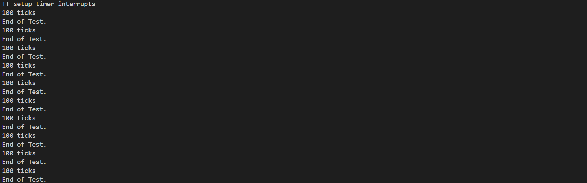

# <center> Lab3 </center>

<center> 金莫迪 廖望 李星宇 </center>

<!-- <div align="center">
  
</div>

<center> gdb 启动流程跟踪与验证 </center> -->

## 实验目的

实验 3 主要讲解的是中断处理机制。操作系统是计算机系统的监管者，必须能对计算机系统状态的突发变化做出反应，这些系统状态可能是程序执行出现异常，或者是突发的外设请求。当计算机系统遇到突发情况时，不得不停止当前的正常工作，应急响应一下，这是需要操作系统来接管，并跳转到对应处理函数进行处理，处理结束后再回到原来的地方继续执行指令。这个过程就是中断处理过程。

- riscv 的中断相关知识
- 中断前后如何进行上下文环境的保存与恢复
- 处理最简单的断点中断和时钟中断

## 实验练习

本次实验包含两个核心练习和三个挑战练习。本次的实验主要是在实验一的基础上完成物理内存管理，并建立一个最简单的页表映射。

### 练习 1：完善中断处理 （需要编程）

请编程完善 trap.c 中的中断处理函数 trap，在对时钟中断进行处理的部分填写 kern/trap/trap.c 函数中处理时钟中断的部分，使操作系统每遇到 100 次时钟中断后，调用 print_ticks 子程序，向屏幕上打印一行文字”100 ticks”，在打印完 10 行后调用 sbi.h 中的 shut_down()函数关机。

### 扩展练习 Challenge1：描述与理解中断流程

回答：描述 ucore 中处理中断异常的流程（从异常的产生开始），其中 mov a0，sp 的目的是什么？SAVE_ALL 中寄寄存器保存在栈中的位置是什么确定的？对于任何中断，\_\_alltraps 中都需要保存所有寄存器吗？请说明理由。

### 扩展练习 Challenge2：理解上下文切换机制

回答：在 trapentry.S 中汇编代码 csrw sscratch, sp；csrrw s0, sscratch, x0 实现了什么操作，目的是什么？save all 里面保存了 stval scause 这些 csr，而在 restore all 里面却不还原它们？那这样 store 的意义何在呢？

### 扩展练习 Challenge3：完善异常中断

编程完善在触发一条非法指令异常和断点异常，在 kern/trap/trap.c 的异常处理函数中捕获，并对其进行处理，简单输出异常类型和异常指令触发地址，即“Illegal instruction caught at 0x(地址)”，“ebreak caught at 0x（地址）”与“Exception type:Illegal instruction"，“Exception type: breakpoint”。

## 实验过程与验证

### 练习 1：完善中断处理 


- 在 `kern/trap/trap.c` 的 `interrupt_handler` 中完成 LAB3 EXERCISE1 处的实现，具体为：
  - 调用 `clock_set_next_event()` 安排下一次时钟中断；
  - `ticks++` 计数，每累积 100 次触发 `print_ticks()` 输出 `100 ticks`；
  - `print_ticks()` 在 `DEBUG_GRADE` 宏下追加输出 `End of Test.` 并触发 panic，便于脚本截断；
  - 计数到 10 次后调用 `sbi_shutdown()` 关机（关闭 `DEBUG_GRADE` 时有效）。

#### 验证与评分

已重写 `tools/grade.sh`，验证项如下：

- 物理内存信息与管理器：
  - 匹配 `memory management: default_pmm_manager`
  - 匹配 `  memory: 0x0000000008000000, [0x0000000080000000, 0x0000000087ffffff].`

- 分配正确性（默认管理器）：
  - 匹配 `check_alloc_page() succeeded!`
  - 匹配 `satp virtual address: 0xffffffffc0205000`
  - 匹配 `satp physical address: 0x0000000080205000`

- 时钟中断与 100 次打印：
  - 匹配 `++ setup timer interrupts`
  - 匹配 `100 ticks`
  - 匹配 `End of Test.`（由 `DEBUG_GRADE` 触发，快速结束）

评分脚本要点：

- 通过 `make print-*` 获取 `QEMU/GDB/GRADE_QEMU_OUT` 等变量；
- `-serial file:$qemu_out` 捕获串口输出；
- 每个 case 单独构建、运行、校验，累积分数；
- `-DDEBUG_GRADE` 使内核在首个 `100 ticks` 后快速结束，避免等待 10 次关机；

测试结果如下：

<div align="center">
  
</div>

<center> 中断测试 </center>


- 在 `kern/trap/trap.c` 的 `interrupt_handler` 中完成 LAB3 EXERCISE1 处的实现，具体为：
  - 调用 `clock_set_next_event()` 安排下一次时钟中断；
  - `ticks++` 计数，每累积 100 次触发 `print_ticks()` 输出 `100 ticks`；
  - `print_ticks()` 在 `DEBUG_GRADE` 宏下追加输出 `End of Test.` 并触发 panic，便于脚本截断；
  - 计数到 10 次后调用 `sbi_shutdown()` 关机（关闭 `DEBUG_GRADE` 时有效）。

#### 验证与评分

已重写 `tools/grade.sh`，验证项如下：

- 物理内存信息与管理器：
  - 匹配 `memory management: default_pmm_manager`
  - 匹配 `  memory: 0x0000000008000000, [0x0000000080000000, 0x0000000087ffffff].`

- 分配正确性（默认管理器）：
  - 匹配 `check_alloc_page() succeeded!`
  - 匹配 `satp virtual address: 0xffffffffc0205000`
  - 匹配 `satp physical address: 0x0000000080205000`

- 时钟中断与 100 次打印：
  - 匹配 `++ setup timer interrupts`
  - 匹配 `100 ticks`
  - 匹配 `End of Test.`（由 `DEBUG_GRADE` 触发，快速结束）

评分脚本要点：

- 通过 `make print-*` 获取 `QEMU/GDB/GRADE_QEMU_OUT` 等变量；
- `-serial file:$qemu_out` 捕获串口输出；
- 每个 case 单独构建、运行、校验，累积分数；
- `-DDEBUG_GRADE` 使内核在首个 `100 ticks` 后快速结束，避免等待 10 次关机；
- 日志保存为以 tag 命名的 `.log` 文件。

#### 运行方法

```bash
make -C lab3 grade
# 或手动执行：
sh lab3/tools/grade.sh -v
```

在 WSL + QEMU 4.1.1 环境下，脚本使用 `-machine virt -bios default` 与 loader 直接加载 `bin/ucore.img`，与 Makefile 保持一致。

也可使用 qemu 验证

```bash
make -C lab3 clean
make -C lab3
make -C lab3 qemu
```

### 扩展练习 Challenge1：描述与理解中断流程

#### 1\. 描述 ucore 中处理中断异常的流程

- 异常发生时

1.  发生了中断，或者 CPU 执行指令时出错或由 ecall 产生一个异常，CPU 都会停止当前指令流。
2.  CPU 需要模式化地做出一系列改变，记录错误信息。
    - 将当前的 PC 保存到`sepc`寄存器中，以便处理完毕后能返回。
    - 将导致中断/异常的原因存入`scause`寄存器。
    - 将一些相关的附加信息存入`stval`寄存器。
    - 硬件自动从用户态或监管态进入监管态。
    - 屏蔽`sstatus`寄存器，防止嵌套。
3.  CPU 会跳转到`stvec`寄存器所指向的地址。在`ucore`中，这个地址被设置为统一的异常入口点，即`__alltraps`。

- 进入\_\_alltraps

1. 需要在软件层面保存上下文，CPU 跳转到`__alltraps`后，开始执行操作系统的汇编代码。寄存器里保存被中断程序的值。
2. `__alltraps`在栈上分配一块空间，用于存放中断帧。
3. 调用`SAVE_ALL`宏。这个宏负责将所有的通用寄存器按照`TrapFrame`结构体定义的顺序，依次存储到刚才分配的栈空间中。
4. 除了通用寄存器，会接着读取`sstatus`、`sepc`等寄存器，并将它们也保存在`TrapFrame`的相应位置。

- C 语言分发

1. 此时，`sp` 寄存器正指向刚刚保存好的`TrapFrame`的起始地址。
2. 执行`mov a0, sp`，将`TrapFrame`的指针作为第一个参数传递。
3. 调用 C 函数`call trap_dispatch`。
4. `trap_dispatch` 函数是一个 C 语言实现的分发器。它接收`TrapFrame`的指针作为参数，它会从中断帧中读取 `scause`来判断中断/异常的类型。根据类型，它会调用一个具体的处理函数。具体的处理函数可能会修改`TrapFrame`的内容。修改返回地址防止重复报错。

- 退出\_\_alltraps

1. `trap_dispatch`处理完毕后，返回到`__alltraps`。
2. 调用`RESTORE_ALL`宏。`TrapFrame`中将`sstatus`、`sepc`等恢复到 CPU 的 CSR 寄存器中。从 `TrapFrame` 中将所有的通用寄存器依次加载回对应的寄存器。
3. 释放栈帧，恢复`sp`寄存器。
4. 执行`sret`指令。

- CPU 硬件返回

`sret`指令会将`sepc`寄存器的值加载回 PC，并根据 `sstatus` 恢复原来的权限和中断使能状态。CPU 从被中断的地方可以继续执行。

#### 2\. `mov a0, sp` 的目的是什么？

**回答：**

这条指令在`SAVE_ALL`执行完毕之后，在`call trap_dispatch`之前执行。`mov a0, sp`的核心目的是将 TrapFrame 的指针作为参数传递给 C 语言处理函数。在`SAVE_ALL`宏执行后，`sp`栈指针已经指向了刚刚在栈上构建的`TrapFrame`的起始地址。C 语言编写的`trap_dispatch`函数需要访问这个 `TrapFrame`，以便读`scause`来判断中断原因，或者读取`sepc`知道从哪里来，或者修改`a0`来设置系统调用的返回值。

#### 3\. `SAVE_ALL` 中寄存器保存在栈中的位置是什么确定的？

**回答：**

是由`TrapFrame`结构体的定义和`SAVE_ALL`汇编宏的实现共同确定的。在`trap.h`，有`TrapFrame`的定义。这个结构体定义了所有需要保存的寄存器，并且规定了它们的顺序。`SAVE_ALL`汇编宏必须严格按照`struct TrapFrame`中成员的偏移量来编写。

```c
struct pushregs {
    uintptr_t zero;  // Hard-wired zero
    uintptr_t ra;    // Return address
    uintptr_t sp;    // Stack pointer
    uintptr_t gp;    // Global pointer
    uintptr_t tp;    // Thread pointer
    uintptr_t t0;    // Temporary
    uintptr_t t1;    // Temporary
    uintptr_t t2;    // Temporary
    uintptr_t s0;    // Saved register/frame pointer
    uintptr_t s1;    // Saved register
    uintptr_t a0;    // Function argument/return value
    uintptr_t a1;    // Function argument/return value
    uintptr_t a2;    // Function argument
    uintptr_t a3;    // Function argument
    uintptr_t a4;    // Function argument
    uintptr_t a5;    // Function argument
    uintptr_t a6;    // Function argument
    uintptr_t a7;    // Function argument
    uintptr_t s2;    // Saved register
    uintptr_t s3;    // Saved register
    uintptr_t s4;    // Saved register
    uintptr_t s5;    // Saved register
    uintptr_t s6;    // Saved register
    uintptr_t s7;    // Saved register
    uintptr_t s8;    // Saved register
    uintptr_t s9;    // Saved register
    uintptr_t s10;   // Saved register
    uintptr_t s11;   // Saved register
    uintptr_t t3;    // Temporary
    uintptr_t t4;    // Temporary
    uintptr_t t5;    // Temporary
    uintptr_t t6;    // Temporary
};

struct trapframe {
    struct pushregs gpr;
    uintptr_t status;
    uintptr_t epc;
    uintptr_t badvaddr;
    uintptr_t cause;
};
```

#### 4\. 对于任何中断，`__alltraps` 中都需要保存所有寄存器吗？请说明理由。

**回答：**

`__alltraps`最好保存所有寄存器。有以下理由

1. `__alltraps`中需要调用`trap_dispatch`。在编译`trap_dispatch`及其调用的任何子函数时，它可以根据需求调用所有上下文涉及到的寄存器。

2. `__alltraps`是一个统一的入口。当 CPU 跳转到这里时，汇编代码并不知道即将要处理的是一个简单的时钟中断，还是一个复杂的缺页异常。保存所有可以使代码更健壮。

### 扩展练习 Challenge2：理解上下文切换机制

回答：在trapentry.S中汇编代码 `csrw sscratch, sp；csrrw s0, sscratch, x0`实现了什么操作，目的是什么？`save all`里面保存了`stval scause`这些csr，而在`restore all`里面却不还原它们？那这样store的意义何在呢？

答：sscratch是一个临时寄存器，这两条汇编指令首先将栈顶指针保存到了sscratch中，在STORE结束后又把栈顶指针取出来，将sscratch赋值为0。stval scause都是临时的寄存器，存储但是不还原。stval存储了这次异常相关的那个值，scause存储了导致异常的原因，这些值都是用来调试和快速定位的，下次来下一个异常覆盖成新的值了，与当前程序的状态也无关，所以无需还原。


### 扩展练习 Challenge3：异常打印验证（断点与非法指令）

- 已在 `kern/mm/pmm.c` 的 `pmm_init()` 尾部添加可选测试hook：当定义 `CH3_TEST` 时会主动触发一次 ebreak 和一次非法指令，便于验证 `trap.c` 中 Challenge3 的处理逻辑。

- 编译与运行：

```bash
make -C lab3 clean
make -C lab3 -j DEFS+='-DCH3_TEST'
make -C lab3 qemu
```
